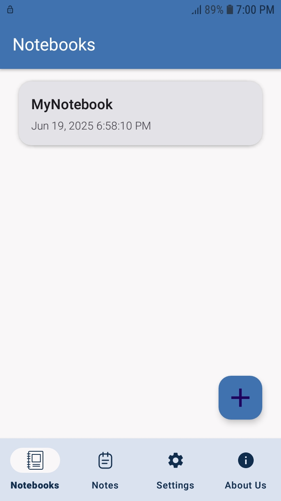
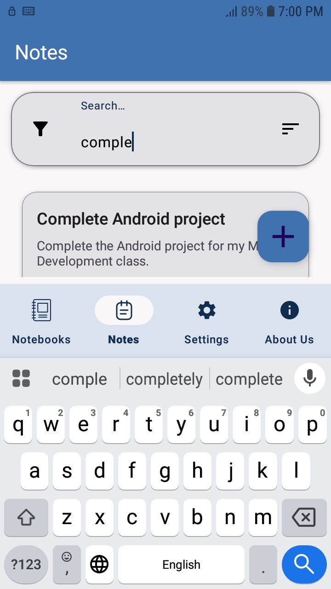
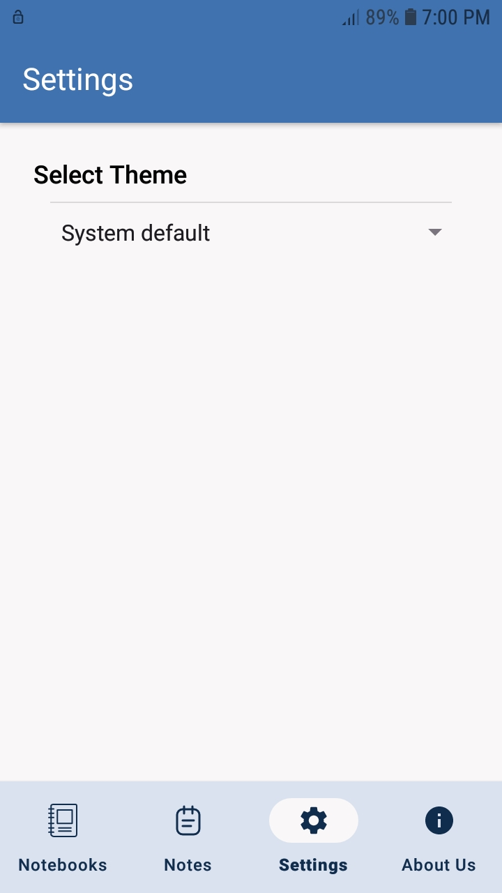

# Daftarak 🗒️

Daftarak is a modern, elegant Android note-taking app that supports notebooks, powerful search and sort features, and a customizable user experience. Developed by a group of students, it's designed to be clean, intuitive, and useful.

## 📱 Features

- 📁 **Notebook Management**

  - Create, update, delete notebooks
  - Organize notes into notebooks

- 📝 **Note Operations**

  - Create, edit, and delete notes
  - Rich note content with title and body

- 🔍 **Search**

  - Search notes by **title**, **body**, or **both**
  - Case-insensitive, fast filtering

- ↕️ **Sort**

  - Sort notes by **title** or **date**
  - Choose **ascending** or **descending** order

- 🎨 **Theme Settings**

  - Toggle between **Light**, **Dark**, and **System Default** themes

- ℹ️ **About Us**

  - Includes information about the students who built the app

- 🚀 **Smooth Onboarding**
  - Splash screen with animation
  - ViewPager-style onboarding for first-time users

## 🖼️ Screenshots

### Home screen



### Note editor


### Search and sort interface



### Settings page



## 🚧 Technologies Used

- **Java**
- **Jetpack Navigation Component**
- **ViewPager2**
- **Material Components**
- **SharedPreferences** for theme & onboarding logic
- **MVVM architecture** (optional, based on your structure)

## 📂 Project Structure

```
com.example.daftarak
├── data
│   ├── dao
│   ├── database
│   └── model
|   └── repository
├── ui
│   ├── adapter
│   ├── fragment
│   │   ├── dialog
│   │   └── onboarding
│   │       └── screens
│   └── viewmodel
|   └── widgets
├── utility
└── MainActivity.java
```

## 🛠️ Getting Started

1. **Clone the repo:**

   ```bash
   git clone https://github.com/mohammadnazarkhani/Daftarak.git
   ```

2. **Open in Android Studio**

3. **Build and run** on an emulator or device running API 27+

## 🤝 Contributors

- Mohammad Nazarkhani
- Mahyar Galdiani

## 📃 License

This project is for educational purposes. Feel free to fork and extend it. [See License](./LICENSE)

---

### ⭐ Star the repo if you like it:

[https://github.com/mohammadnazarkhani/Daftarak](https://github.com/mohammadnazarkhani/Daftarak)
